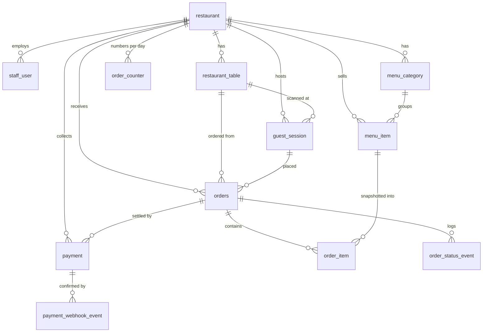

# Low-Level Design

Restaurant QR Table Ordering Platform · Go/Gin + Postgres + Next.js

This document describes **what is actually built**, the relationships between the tables, and the
session design for a QR that is printed once and reused forever. Requirements are in
[PRD.md](./PRD.md); the reasoning behind each choice is in [DECISIONS.md](./DECISIONS.md); the wire
contract is in [API.md](./API.md).

---

## 0. Where this differs from the earlier LLD draft

An earlier draft of this design proposed a schema that the implementation deliberately departs
from. The differences are listed up front so nobody reads this expecting the draft.

| Draft | Built | Why |
| --- | --- | --- |
| `UUID` primary keys | `SERIAL` PK **plus** a separate prefixed `uid` (`ord_x7k2m9qp4rt8`) | A UUID PK costs 16 bytes in every index and every foreign key, and random UUIDs fragment B-tree inserts. An integer PK is internal; the prefixed uid is what appears in URLs and logs, and its prefix makes a value pasted into the wrong endpoint fail loudly instead of resolving to an unrelated row. |
| `price DECIMAL(10,2)` | `price_minor BIGINT` (paise) | `DECIMAL` is exact in the database but becomes a float somewhere in Go, TypeScript, or JSON. Integer minor units are exact end to end ([D7](./DECISIONS.md)). |
| `tax` as a percentage | `tax_bps INTEGER` (500 = 5.00%) | Keeps rate arithmetic integral too. |
| `carts` + `cart_items` tables | **No server-side cart.** Cart lives in the browser | A cart is a draft nobody else needs to see. Persisting every quantity tap costs a round trip on a 3G connection (PRD §7) and buys nothing — the server re-prices the whole order at placement anyway. |
| `order_sessions` shared per table | `guest_session`, one per scan | See §5. This is the substantive difference and the subject of the question this document answers. |
| `orders 1───1 payments` | `orders 1───* payment` | A failed UPI attempt followed by cash at the counter is two payment rows on one order. One-to-one would force overwriting the failure and losing the audit trail. |
| `is_veg BOOLEAN` | `food_type` enum: `veg` / `non_veg` / `egg` | A boolean cannot express "contains egg", which is a distinct category for a large share of diners in this market. |
| `status` as Postgres `ENUM` | `VARCHAR` + `CHECK` constraint | Adding a value to a Postgres enum type is a DDL migration that has historically taken locks; a CHECK constraint is cheap to alter and equally strict. |

**Agreed with the draft:** Postgres is the right database, and for the reasons the draft gives —
the data is relational, order placement needs real ACID guarantees, and `JSONB` covers the one
semi-structured need (verified provider payloads on `payment.raw_payload`) without a second store.

---

## 1. Schema as built

12 application tables. Every tenant-owned row carries `restaurant_id` ([D3](./DECISIONS.md)).

> A 13th table, `dbeaver_menu_item`, exists in the local database from a CSV import. It is not part
> of the application schema and nothing reads it.

### 1.1 Tenancy and identity

**`restaurant`** — the tenant root.
`id`, `uid` (`rst_…`), `name`, `slug` (unique; appears in `/r/{slug}`), `description`, `logo_url`,
`address`, `phone`, `currency`, `timezone`, `gst_number`, `tax_bps`, `service_charge_bps`,
`upi_vpa`, `upi_payee_name`, `payment_provider`, `status`, timestamps.

`timezone` is load-bearing: the daily order-number counter and the dashboard's date windows are
computed in the restaurant's zone, not UTC, because a 1am order belongs to the previous evening's
service ([D9](./DECISIONS.md)).

**`staff_user`** — an admin login. `role` is `owner` / `manager` / `staff`; `password_hash` is
bcrypt. Email is unique **per restaurant**, not globally, because the same person may staff two
unrelated restaurants on the platform.

**`restaurant_table`** — a physical table.
`label` ("12", "Patio 2") is what is printed on the card. `qr_token` (VARCHAR(64), unique) is the
opaque, rotatable value the QR encodes — deliberately **not** the table id, because `…/t/17`
invites a diner to try `…/t/18` and order onto someone else's table, and it leaks the floor size
([D4](./DECISIONS.md)).

### 1.2 Menu

**`menu_category`** — `name`, `sort_order`, `status`. Unique `(restaurant_id, name)`.

**`menu_item`** — `name`, `description`, `image_url`, `price_minor`, `food_type`, `spice_level`,
`is_available`, `is_bestseller`, `prep_time_mins`, `sort_order`, `status`.

`is_available` and `status` are separate columns on purpose. Availability is "we ran out tonight";
status is "does this exist on the menu at all". Archiving a dish that sold out for one evening
would break its order history.

### 1.3 Diner identity

**`guest_session`** — the anonymous diner. `token` (VARCHAR(128), unique) is the bearer value held
in the browser; `expires_at` bounds it at 12 hours; `user_agent` is kept, truncated, for support.
There is no login anywhere in the diner flow ([D5](./DECISIONS.md)).

### 1.4 Orders

**`orders`** (plural: `order` is a reserved SQL word) — 29 columns. The ones that carry design:

- `order_number` — the short daily counter staff shout across a kitchen ("A-014"). Allocated under
  a row lock ([D9](./DECISIONS.md)).
- `status` — the kitchen lifecycle, CHECK-constrained; transitions enforced by the state machine.
- `subtotal_minor`, `tax_minor`, `service_charge_minor`, `discount_minor`, `total_minor` — **stored,
  not derived on read**, so a later change to the tax rate cannot retroactively alter a settled bill.
- `payment_status` — deliberately separate from `status`. A counter order is served long before it
  is paid; an online order is paid before it is accepted. One column could not represent both.
- `idempotency_key` — unique per restaurant, partial index (NULLs must not collide) ([D12](./DECISIONS.md)).
- Per-status timestamps: `placed_at`, `accepted_at`, `preparing_at`, `ready_at`, `served_at`,
  `completed_at`, `cancelled_at`.

**`order_item`** — `name_snapshot`, `unit_price_minor`, `food_type` are **copied at order time**, not
joined live from `menu_item`. A price rise at 8pm must not rewrite the total of a 7:45pm order, and
a renamed dish must still read correctly on last month's bill ([D8](./DECISIONS.md)). `menu_item_id`
is retained for analytics only.

**`order_status_event`** — append-only transition log. Renders the diner's timeline and answers
"who cancelled table 7's order" after the fact. `actor_type` is `guest` / `staff` / `system`.

**`order_counter`** — one row per `(restaurant_id, business_date)`, incremented under
`SELECT … FOR UPDATE`. A counter table rather than a sequence because the number resets daily and
is scoped per restaurant; rather than `SELECT COUNT(*)` because two concurrent diners would compute
the same count.

### 1.5 Payments

**`payment`** — one attempt. `provider` (`upi_static` / `razorpay` / `mock` / `counter`),
`reference` (the short string echoed in the UPI note, which is the entire reconciliation mechanism
for static UPI), `upi_intent_url`, `raw_payload` (JSONB, verified provider payload for disputes).

**`payment_webhook_event`** — the idempotency ledger. Unique `(provider, event_id)`. Gateways retry
as a matter of course, so the insert **failing** is how a redelivery is detected — a
SELECT-then-INSERT would be racy ([D2](./DECISIONS.md)).

---

## 2. Relationships



### 2.1 Cardinalities, and the ones that are not obvious

| Relationship | Cardinality | Note |
| --- | --- | --- |
| `restaurant` → `restaurant_table` | 1 → many | |
| `restaurant_table` → `guest_session` | 1 → many | Many sittings over a table's life, **and today many concurrent ones** — see §5. |
| `guest_session` → `orders` | 1 → many | A table orders starters, then mains. |
| `orders` → `order_item` | 1 → many | |
| `orders` → `payment` | 1 → **many** | A failed UPI attempt then cash is two rows. |
| `menu_item` → `order_item` | 1 → many | Analytics only; display and pricing use the snapshot. |
| `payment` → `payment_webhook_event` | 1 → many | Several events per payment: authorized, captured, refunded. |

### 2.2 Delete rules, and why each was chosen

The `ON DELETE` rule is where a schema quietly decides what history it is willing to destroy.

| Foreign key | Rule | Reasoning |
| --- | --- | --- |
| everything → `restaurant` | `CASCADE` | Removing a tenant removes its data. The only correct answer. |
| `order_item` → `orders` | `CASCADE` | Lines have no meaning without their order. |
| `order_status_event` → `orders` | `CASCADE` | Same. |
| `payment` → `orders` | `CASCADE` | Same. |
| `orders` → `restaurant_table` | **`RESTRICT`** | Deleting a table must not delete the orders taken at it. Tables are archived (`status`), not deleted. |
| `order_item` → `menu_item` | **`RESTRICT`** | Deleting a dish must not delete the record of having sold it. Dishes are archived. |
| `menu_item` → `menu_category` | **`RESTRICT`** | A dish cannot be orphaned into no section. |
| `orders` → `guest_session` | **`SET NULL`** | Sessions are ephemeral and reaped on expiry; the order must survive its session. This is what lets the sweeper in §6 run safely. |
| `payment_webhook_event` → `payment` | `SET NULL` | A webhook naming a payment we never created is still worth recording. |

---

## 3. Component design

```
     ┌──────────────────┐          ┌──────────────────┐
     │  apps/diner      │          │  apps/admin      │
     │  Next.js 15      │          │  Next.js 15      │
     │  :3000  public   │          │  :3001  staff    │
     │  X-Guest-Token   │          │  Bearer JWT      │
     └────────┬─────────┘          └────────┬─────────┘
              │        packages/shared (types, money, status labels)
              │        packages/api-client (typed clients, error mapping)
              │        packages/ui (the few shared primitives)
              └──────────────┬──────────────┘
                             │  HTTP + WebSocket
                   ┌─────────▼──────────┐
                   │  Go 1.25 / Gin     │  :8080
                   │                    │
                   │  controllers  ─────┤  bind, resolve principal, one service call, reply
                   │  services     ─────┤  business rules, transactions, ApplicationError
                   │  repositories ─────┤  GORM only, wrapped plain errors
                   │  payments     ─────┤  Provider interface: upi_static / razorpay / mock
                   │  realtime     ─────┤  WebSocket hub, topic fan-out
                   └─────────┬──────────┘
                             │
                   ┌─────────▼──────────┐
                   │  Postgres 17       │  :5434
                   └────────────────────┘
```

Two frontend apps rather than one, because the diner app is public and must load fast on 3G while
the admin panel is authenticated and data-dense — they should not share a bundle
([D11](./DECISIONS.md)).

### 3.1 Layer contract

| Layer | Returns | Never |
| --- | --- | --- |
| `controllers` | whatever the service gave it | an `if` about domain state |
| `services` | `*response.ApplicationError` | imports `gin` |
| `repositories` | wrapped plain errors | validates, or picks an HTTP status |

Only a service knows whether a missing row is an error: `gorm.ErrRecordNotFound` for "no session
with this token" is a 401, the same error for "no restaurant with this slug" is a 404.

### 3.2 Realtime

WebSocket hub with two topic kinds — `restaurant:{uid}` for the admin board, `order:{uid}` for one
diner. **Messages are hints, not state**: an event names an order and a status, and the client
refetches over HTTP. That is what makes a dropped frame harmless and why the 5-second polling
fallback is a complete substitute rather than a degraded mode ([D10](./DECISIONS.md)).

Authentication is by query parameter, because a browser `WebSocket` cannot set headers. The server
accepts a query token **only on a genuine upgrade request**; every ordinary request still refuses
one.

---

## 4. What the QR encodes

The same in both deployment shapes — a sticker on the table, or a code shown on a tablet:

```
https://order.example.com/t/{qr_token}          per table
https://order.example.com/r/{restaurant_slug}   per restaurant (fallback / food-court board)
```

**The QR is static and carries no session.** It encodes a table identity and nothing else. It is
printed once and never changes — until staff deliberately rotate it, which is the recovery path for
a code that has leaked (`POST /admin/v1/tables/:uid/qr/rotate`, and the printed sticker stops
working immediately).

All session intelligence is server-side, keyed off that fixed token. That much matches the earlier
draft exactly.

---

## 5. Session lifecycle — the substantive question

The draft proposed **get-or-create a shared session per table**. The implementation does
**a new session per scan**. Neither is unambiguously right, and this section works through why.

### 5.1 What is built today

```
GET /api/public/v1/t/{qr_token}
  → resolve table by token; reject if table or restaurant inactive
  → INSERT guest_session (new token, expires_at = now + 12h)
  → return { session token, table label, the whole menu }
```

Every scan creates a new row. Consequences:

| | |
| --- | --- |
| ✅ Isolation | The next party to sit down cannot see or cancel the previous party's orders. There is no stale-session failure mode at all, because nothing is ever reused. |
| ✅ Zero moving parts | No close endpoint, no TTL race, nothing for staff to remember. |
| ❌ No collaboration | Four friends scanning the same sticker get four sessions. Each sees only their own orders in "My orders". |
| ❌ No table-level bill in the diner app | Orders are grouped by table for the **kitchen** (`orders.table_id`), so staff see the table correctly and the admin board is right. But no diner can see the table's combined total. |

So the kitchen side is already correct. The gap is entirely diner-facing.

### 5.2 Why get-or-create per table is the wrong fix

The draft's mechanism — reuse the table's `active` session, close it explicitly, TTL as a backstop
— has a failure mode worth stating precisely, because it is a privacy bug rather than an
inconvenience.

The session token **is the diner's authorisation**. Handing party B party A's session means B can
list A's orders and **cancel** one. The mitigations do not close the window:

- **Explicit close depends on staff remembering**, during service, on the busiest hour of the day.
- **A 2–3 hour TTL is far longer than table turnover**, which is more like 30–60 minutes. So between
  "staff forgot" and "TTL fires" there is a window of over an hour in which the new party at the
  table is holding a stranger's credentials.

A design whose safety net is looser than the thing it is catching is not a safety net.

### 5.3 Recommended design: two levels

Keep the per-scan session as **identity**. Add a per-table **sitting** as the grouping — one
occupancy of a table, from seated to bill settled.

```
restaurant_table 1 ──── * table_sitting          (many over time, ONE open at a time)
table_sitting    1 ──── * guest_session          (one per phone that scanned)
table_sitting    1 ──── * orders                 (the party's whole bill)
guest_session    1 ──── * orders                 (who ordered what)
```

Scan logic becomes:

```
1. resolve table by qr_token
2. find the table's OPEN sitting          (closed_at IS NULL, last_activity_at > now - 90m)
     none → INSERT table_sitting (open)
3. INSERT guest_session  ALWAYS           ← new token every scan, never shared
     linked to that sitting
4. return session token + sitting id + menu
```

Every order carries both `guest_session_id` (who placed it) and `table_sitting_id` (whose bill it
is on).

**What this buys**

- **Collaboration.** The diner app can show "your orders" and "this table's orders" for the current
  sitting — which is what the draft actually wanted.
- **One bill per party.** Sum the sitting, not the session.
- **Isolation preserved.** Each phone keeps its own token. Cancelling is authorised by
  `guest_session_id`, so a diner can only cancel what they ordered — never a neighbour's.
- **A much smaller blast radius when a sitting is not closed in time.** Party B would *see* party A's
  orders on the table view; they could not act on them, and their own identity is still distinct.

**Closing a sitting — three mechanisms, in order of reliability**

1. **Automatic, on settlement.** When every order on the sitting is terminal **and** paid, close it
   immediately. This covers the overwhelming majority of real sittings with no human action, which
   is the mechanism the draft was missing.
2. **Explicit, by staff.** `POST /api/admin/v1/tables/:uid/sitting/close` — a "table cleared"
   button on the floor view, and the natural extension of an action staff already take. Also gives
   the tablet case an answer: staff taps it as the party leaves.
3. **TTL backstop.** A sweeper closes sittings idle beyond 90 minutes. Only covers the abandoned
   case — an order placed and never paid — because (1) handles the normal one.

**Schema delta**

```sql
CREATE TABLE table_sitting (
    id               SERIAL PRIMARY KEY,
    uid              VARCHAR(64) NOT NULL UNIQUE,
    restaurant_id    INTEGER NOT NULL REFERENCES restaurant (id) ON DELETE CASCADE,
    table_id         INTEGER NOT NULL REFERENCES restaurant_table (id) ON DELETE RESTRICT,
    opened_at        TIMESTAMPTZ NOT NULL DEFAULT NOW(),
    last_activity_at TIMESTAMPTZ NOT NULL DEFAULT NOW(),
    closed_at        TIMESTAMPTZ,
    closed_by        VARCHAR(64),          -- staff uid, or 'system'
    created_at       TIMESTAMPTZ NOT NULL DEFAULT NOW(),
    updated_at       TIMESTAMPTZ NOT NULL DEFAULT NOW()
);

-- At most ONE open sitting per table, enforced by the database rather than by application care.
-- Without this, two diners scanning simultaneously both find no open sitting and both create one.
CREATE UNIQUE INDEX idx_table_sitting_one_open
    ON table_sitting (table_id) WHERE closed_at IS NULL;

ALTER TABLE guest_session ADD COLUMN sitting_id INTEGER REFERENCES table_sitting (id) ON DELETE SET NULL;
ALTER TABLE orders        ADD COLUMN sitting_id INTEGER REFERENCES table_sitting (id) ON DELETE SET NULL;
CREATE INDEX idx_orders_sitting ON orders (sitting_id);
```

The partial unique index is the important line. Step 2 of the scan logic is a read followed by a
write, so two phones scanning at the same instant will both see no open sitting. The index makes the
loser's insert fail, and the retry finds the winner's row — the same pattern the order idempotency
key already uses ([D12](./DECISIONS.md)).

**API delta**

| | |
| --- | --- |
| `GET /api/guest/v1/sitting` | The table's orders and combined total for the current sitting |
| `POST /api/admin/v1/tables/:uid/sitting/close` | "Table cleared" |
| `GET /api/admin/v1/tables` | Add the open sitting and its unpaid total to each table |

### 5.4 Sticker versus tablet

The QR is identical in both cases, and so is everything above. The only difference is which closing
mechanism staff lean on:

| | Sticker on the table | QR on a tablet at the table |
| --- | --- | --- |
| QR value | static, printed | static, displayed |
| Diner scans | their own phone | their own phone |
| Closing a sitting | automatic on settlement, or the floor view's button | the same, plus staff can close it on the tablet itself as the party leaves |
| If the code leaks | rotate the token, reprint the sticker | rotate the token, the tablet picks up the new one on refresh |

The tablet is strictly easier, because the closing action is already in someone's hand. Nothing in
the design needs to know which shape is in use.

### 5.5 Why not implemented yet

It is a schema migration plus a new service, and it changes the meaning of "my orders" in the diner
app. It is the right next change, not a bug fix, so it is written up here rather than added quietly.
The current per-scan behaviour is safe in the meantime — it errs toward isolation, and the failure
it gives up on (collaboration) is visible to a diner rather than silent.

---

## 6. Status: what is done, what is not

Verified against the running system, not from memory.

### 6.1 Done

**Database and tenancy**

- Postgres 17. 12 application tables, 12 numbered migration pairs. CI applies every down migration
  in reverse, asserts zero tables remain, and re-applies forwards.
- Multi-tenant from migration 001. Every tenant-scoped repository method takes `restaurantID` as a
  parameter, so a query that forgets to scope itself does not compile.
- Two seeded restaurants, deliberately unalike (one has a service charge, the other does not).

**QR and sessions**

- Per-table QR with an opaque, rotatable token; server-rendered PNG; A4 print sheet.
- Restaurant-level fallback QR, plus a `/qr` gallery showing one code per restaurant.
- Per-scan guest session, 12-hour expiry, no login anywhere in the diner flow.

**Menu**

- Public menu in one response (restaurant + categories + items + tax rates), two queries.
- Admin CRUD for categories and items; one-tap sold-out toggle available to every staff role.
- Sold-out items are returned and greyed out, not hidden.

**Orders**

- Client-side cart, keyed per table.
- Server-side pricing from the live menu. The request DTO carries no amount at all.
- Idempotent placement: 10 concurrent duplicate submits produce one order.
- Full lifecycle with an enforced state machine; `next_statuses` sent to the client so the UI cannot
  drift from it.
- Append-only status log with actor attribution.
- Per-item cancel with re-pricing, refusing to empty an order.
- Row locking verified under real concurrency: 8 simultaneous accepts resolve to exactly one winner;
  20 simultaneous checkouts get 20 distinct order numbers.

**Payments**

- `Provider` interface with three implementations: `upi_static` (default), `razorpay`
  (credentials-gated), `mock` (never registered in production).
- UPI deep link + server-rendered QR; short human-matchable reference.
- Webhook: HMAC verified **before** any parsing, idempotency ledger, amount-mismatch refusal.
- Staff confirmation for cash and static UPI, attributed to the signed-in user; a served order that
  gets paid closes itself.

**Realtime, auth, ops**

- WebSocket hub with per-restaurant and per-order topics; 5-second polling fallback; slow clients
  dropped rather than waited for.
- Staff JWT with access/refresh split, three roles, timing-safe login, last-owner lockout guard.
- Client disconnects answered with 499 and logged at Info, not 500 at Error.
- Dashboard stats windowed in the restaurant's timezone; null averages render `--`, never `0`.
- Both frontends complete: 9 diner routes, 8 admin routes.
- **Bruno API collection**: 53 requests over 11 folders, covering all 46 routes. Chains state
  through post-response scripts, so a top-to-bottom run works from an empty database. `go test
  ./cmd/app` fails if a route has no request, or if a request points at a route that no longer
  exists.
- CI: format, vet, race tests, migration round-trip, smoke, concurrency, the Bruno collection, and
  both browser journeys.

**Verification** — 68 API assertions · 3 concurrency scenarios · 37 diner browser assertions ·
53 admin browser assertions · 14 QR/multi-tenant assertions · 31 Go unit subtests · 6 price-parser
tests. All against real Postgres and a real browser, nothing stubbed.

### 6.2 Not done

**Gaps in what exists** — these are loose ends, not future features:

| | |
| --- | --- |
| **Guest-session sweeper is never called** | `RepositoryGuestSession.DeleteExpired` is implemented and tested-by-signature but no scheduler invokes it. `guest_session` grows without bound. Needs a ticker in `cmd/app` or a cron entrypoint. **Smallest real gap; fix first.** |
| **No Dockerfiles** | Nothing containerises the API or either app. `docker-compose.yml` covers Postgres and Redis only, so there is no deployment path yet. |
| **Razorpay untested against the live gateway** | The adapter, HMAC verification and webhook normalisation are unit-tested against fixtures. No call has been made to Razorpay itself. |
| **Admin browser suite not re-run** | 53/53 at last run, but the app has not been served on :3001 since the `/qr` and 499 changes. |

**Designed, not built**

| | |
| --- | --- |
| **Table sittings** (§5.3) | Collaborative ordering and a single table bill. The main outstanding design. |
| **Refunds** | `PaymentStatus` has `refunded` and `Capabilities.SupportsRefund` exists; no endpoint or flow. |
| **Image upload** | `menu_item.image_url` takes a URL. No storage, no upload, no resizing — a restaurant must host its own photos. |

**Deliberately out of scope for v1** — each is a recorded decision, not an omission:

| | |
| --- | --- |
| Order editing after placement | [D6](./DECISIONS.md) — cancel before accept; otherwise place another order. |
| Cross-visit order history | [D5](./DECISIONS.md) — needs an identity, which needs a login. |
| Franchise / multi-restaurant admin | [D3](./DECISIONS.md) — schema is ready, auth is single-tenant. |
| Hindi / i18n | PRD §7 future. Error **codes** are already stable and separate from messages, so translating copy cannot change behaviour. |
| Table reservations, loyalty, native apps, waiter-assisted ordering | PRD §8. |

**Known operational limits** — true, and worth knowing before deploying:

- The rate limiter is **in-process**, so it counts per instance and dilutes across replicas. Redis
  is in `docker-compose.yml` under the `optional` profile for when that matters.
- Admin tokens live in `localStorage`, which is XSS-readable. Accepted because the panel is a
  separate origin and loads no third-party script; the trigger to change it is the moment that
  stops being true.
- `/_next/image` is configured to accept any https host, which makes it an open image proxy. The
  alternative — an allowlist — breaks restaurants' own photo hosts.
- `GET /api/public/v1/restaurants` makes the tenant list enumerable ([D13](./DECISIONS.md)). Fine
  for a walk-in platform, wrong for a white-label deployment.
